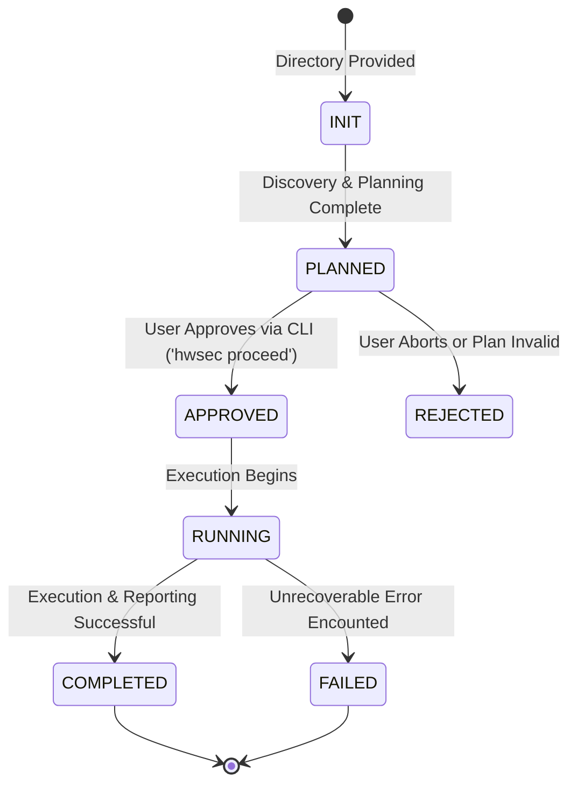
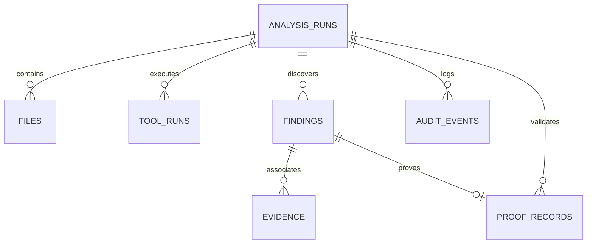
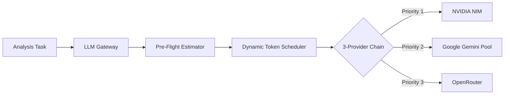

# HWSEC — Engineering Implementation Guide

**Authoritative Architecture and Implementation Specification**  
*Document Version: 1.0.0 | System Revision: 2026-09-08*

---

## 1. Architecture Overview

HWSEC executes a disciplined, multi-stage hybrid analysis pipeline designed to discover, reason about, verify, and prove security vulnerabilities across mixed hardware and software repositories.

```
CLI Interface
     │
     ▼
Repository Discovery ──► File Fingerprinting & Incremental Cache Check
     │
     ▼
Planning Engine ──────► Analysis Plan (plan.md) & Approval Boundary
     │
     ▼ [Human Approval Gate]
Analysis Broker ──────► Capability-Based Analyzer Dispatch
     │                  ├── Hardware (Verilator, Yosys, SymbiYosys, AFL++)
     │                  └── Software (Semgrep, Joern CPG)
     ▼
Raw Evidence Ingestion ──► SQLite Persistence (runs, files, tool_runs, evidence, findings)
     │
     ▼
CodeGraph Construction ──► Multi-layer Graph (Code, Security Invariants, Evidence)
     │
     ▼
Knowledge & RAG Engine ──► Semantic Retrieval via Qdrant / Local Fallback
     │
     ▼
Candidate Escalation ──► Disagreement Detection & Coverage Matrix Scoring
     │
     ▼
Intelligence Pipeline ──► Suspicion Scoring, Hypothesis Generation & Invariant Synthesis
     │
     ▼
Technical Verifier ────► Layered Verification (E0 to E5 Evidence Ladder)
     │
     ▼
Proof Engine ──────────► Ephemeral Sandbox Proof-of-Impact Reproduction
     │
     ▼
Evidence Correlator ───► Multi-finding Attack Paths & Component Clustering
     │
     ▼
Reporting Engine ──────► Final Markdown Audit Report & JSON Artifacts
```

---

## 2. Repository Structure

The production codebase is organized into modular layers separating core framework logic from domain-specific tool adapters, background workers, tests, and documentation:

```
hwsec/
├── src/
│   ├── index.js                     # Production CLI entry point (Commander.js)
│   ├── core/                        # Core architectural framework
│   │   ├── state.js                 # Analysis lifecycle state machine & transition rules
│   │   ├── schema.js                # Authoritative data model (Findings, Evidence, Proofs)
│   │   ├── db.js                    # SQLite database layer (better-sqlite3 / node:sqlite)
│   │   ├── discovery.js             # Recursive multi-language repository scanner & hasher
│   │   ├── planner.js               # Tool selection, pipeline planning, and plan.md generator
│   │   ├── broker.js                # Capability-based tool execution & worker dispatcher
│   │   ├── config.js                # Configuration loader, validator, and sanitizer
│   │   ├── execUtils.js             # Safe child process spawner with timeout & buffer limits
│   │   ├── proofSandbox.js          # Ephemeral isolated sandbox with credential stripping
│   │   ├── coverageMatrix.js        # 14 CWE families × 6 languages × 6 tools coverage mapper
│   │   ├── benchmark.js             # Benchmark crawler & manifest evaluation loader
│   │   ├── graph/
│   │   │   └── codeGraph.js         # Tri-layer property graph (Code, Security, Evidence)
│   │   ├── knowledge/
│   │   │   ├── rag.js               # Qdrant client, dense vector embeddings & retrieval
│   │   │   └── proofMemory.js       # Persistent proof strategy RAG & CWE recommendation engine
│   │   ├── llm/
│   │   │   ├── gateway.js           # 3-provider failover chain (NVIDIA -> Gemini -> OpenRouter)
│   │   │   ├── modelRouter.js       # Task-to-model capability & availability router
│   │   │   ├── modelRegistry.js     # Registry of model parameters, tokens, and RPM limits
│   │   │   ├── preflightEstimator.js# Token, latency, and cost pre-flight estimation
│   │   │   ├── dynamicTokenScheduler.js # Token-aware candidate scheduler (RUN/DEFER/SKIP)
│   │   │   ├── tokenBatcher.js      # Prompt packing & token budget optimizer
│   │   │   ├── geminiProvider.js    # Multi-key round-robin Google Gemini provider
│   │   │   └── openRouterProvider.js# OpenRouter OpenAI-compatible API provider
│   │   ├── escalation/
│   │   │   └── adaptiveEscalation.js# 6-level adaptive compute escalation engine
│   │   └── suspicion/
│   │       ├── engine.js            # Target ranking via complexity, boundary & SAST signals
│   │       └── disagreement.js      # Analyzer conflict & false-negative detector
│   ├── domains/
│   │   ├── hardware/
│   │   │   └── tools/
│   │   │       ├── verilator.js     # Verilator RTL linter adapter
│   │   │       ├── yosys.js         # Yosys synthesis & formal property checker adapter
│   │   │       └── symbiyosys.js    # SymbiYosys BMC depth=20 runner & counterexample parser
│   │   └── software/
│   │       └── tools/
│   │           ├── semgrep.js       # Semgrep pattern SAST scanner adapter
│   │           └── joern.js         # Joern CPG dataflow & reachability adapter
│   ├── tools/
│   │   ├── base.js                  # ToolAdapter base class and capability contracts
│   │   ├── harnessGen.js            # Fuzzing and simulation harness synthesizers
│   │   └── afl.js                   # AFL++ hardware model fuzzing adapter
│   └── workers/
│       ├── candidateGenerator.js    # Multi-source candidate pooling & boundary discovery
│       ├── hypothesisGenerator.js   # Grounded LLM security hypothesis formulation
│       ├── invariantSynthesizer.js  # Security invariant and property synthesizer
│       ├── verifier.js              # LayeredVerifier (E0-E5 technical evidence ladder)
│       ├── proofVerifier.js         # ControlledProofVerifier (Anti-exploit sandbox runner)
│       ├── evidenceCorrelation.js   # Evidence graph clustering & attack-path assembler
│       └── correlator.js            # Cross-finding correlation worker
├── tests/                           # Master test suite and validation harnesses
│   ├── run_all_tests.js             # Master test runner (executes all 25 suites)
│   ├── test_controlled_proof_verifier.js # 20-point proof engine test suite
│   ├── test_exploit_preflight.js    # Pre-flight estimator verification
│   ├── test_preflight_scheduler.js  # Dynamic scheduler verification
│   ├── fixtures/                    # Test fixtures, RTL modules, and vulnerable targets
│   ├── demos/                       # Standalone correlation & tool demonstration scripts
│   └── helpers/                     # Environment verification and Joern runner scripts
├── audit/                           # Adversarial Security Validation Engine
│   ├── runners/main-runner.js       # Adversarial test runner (50 security invariants)
│   ├── tests/                       # Injection, traversal, provenance, and stress suites
│   └── reports/                     # Historical audit reports and JSON verdicts
├── scripts/                         # Operational evaluation and benchmark scripts
│   └── evaluate_benchmarks.js       # Precision/recall ground truth evaluation
├── manifests/                       # Authoritative benchmark configs & ground truth datasets
├── quality-benchmark/               # Benchmarks across C, C++, Java, Go, Python, and Hardware
├── requirements.md                  # Definitive installation and system requirements
├── implementation.md                # This document
├── walkthrough.md                   # Engineering walkthrough and execution guide
└── DECISIONS.md                     # Architectural Decision Records (ADR-001 to ADR-010)
```

---

## 3. Core Data Flow

The flow of information through HWSEC guarantees traceability from source code bytes to final verified findings:

```
[Target Directory]
       │
       ▼
1. discovery.js ──────► Scans files, detects languages, computes SHA-256 digests
       │                 Output: RepositoryInventory
       ▼
2. planner.js ────────► Selects matching tool adapters based on detected languages
       │                 Generates: plan.md & analysis.json (Status: PLANNED)
       ▼
3. broker.js ─────────► Dispatches tools sequentially with timeout/resource bounds
       │                 Collects: Raw Tool Logs, Exit Codes, Output Files
       ▼
4. schema.js ─────────► Normalizes findings into standard Finding & Evidence objects
       │                 Persists to: SQLite (runs, files, tool_runs, findings, evidence)
       ▼
5. codeGraph.js ──────► Ingests findings, files, and calls into tri-layer graph
       │                 Extracts: Sinks, Sources, Dangerous APIs, and Boundaries
       ▼
6. rag.js ────────────► Retrieves historical CWE context & architecture invariants
       │
       ▼
7. candidateGen.js ───► Combines SAST findings, boundary calls, and tool disagreements
       │                 Output: Escalated Candidate Pool
       ▼
8. hypothesisGen.js ──► Generates grounded hypotheses with invariant definitions
       │
       ▼
9. verifier.js ───────► Applies E0-E5 Evidence Ladder; checks concrete technical traces
       │
       ▼
10. proofVerifier.js ─► Executes deterministic local regression tests in isolated sandbox
       │                 Computes: SHA-256 proof hash, 3/3 repetition count
       ▼
11. correlator.js ────► Builds attack paths connecting multiple verified findings
       │
       ▼
12. reportGen ────────► Emits final.md, evidence_graph.json, and audit trail
```

---

## 4. State Machine Architecture

Every analysis run adheres to a deterministic, persistent state machine governed by `src/core/state.js`:



### State Definitions & Invariants
- **`INIT`**: Analysis record initialized in SQLite with target path and unique timestamped run ID.
- **`PLANNED`**: Repository discovered, tools selected, token budgets estimated, and `plan.md` written to disk. **Execution is strictly blocked in this state.**
- **`APPROVED`**: Explicit human authorization recorded in database. Transition only occurs when `hwsec proceed <analysis-id>` is invoked.
- **`RUNNING`**: Tool broker executing analyzers, populating graph, and running proof validation.
- **`COMPLETED`**: All phases concluded, findings verified, proof records persisted, and `final.md` emitted.
- **`FAILED`**: Run aborted due to unrecoverable exception or system termination; partial telemetry preserved in database.

---

## 5. CLI Architecture

HWSEC exposes a production command line powered by Commander.js in `src/index.js`:

| Command | Syntax | Description |
| :--- | :--- | :--- |
| **`analyze`** | `hwsec analyze <dir> [options]` | Discovers repository, builds plan, estimates token budget, and generates `plan.md`. Does not execute tools. |
| **`proceed`** | `hwsec proceed <analysis-id> [options]` | Validates approval gate, transitions status to `RUNNING`, and executes the full analysis and proof pipeline. |
| **`status`** | `hwsec status <analysis-id>` | Displays the current lifecycle state, completed phases, runtime duration, and finding counts. |
| **`proof`** | `hwsec proof <analysis-id\|finding-id> [options]` | Runs targeted controlled proof-of-impact validation on a specific finding or all candidates in an analysis. |
| **`proof-status`**| `hwsec proof-status <proof-id>` | Inspects the cryptographic SHA-256 provenance, reproduction count, impact class, and execution logs of a proof. |
| **`report`** | `hwsec report <analysis-id> [options]` | Generates or regenerates final markdown reports, correlation attack graphs, and JSON summaries. |

---

## 6. Repository Discovery

Implemented in `src/core/discovery.js`, the discovery engine systematically indexes target codebases:
- **Recursive Directory Walk**: Scans codebases with depth bounds (default max depth: 20) and size thresholds (ignores files > 2 MB to protect heap).
- **Language Detection**: Classifies files using file extensions, shebang lines, and syntax markers into `c`, `cpp`, `python`, `java`, `go`, `verilog`, and `systemverilog`.
- **Exclusion Filters**: Automatically prunes non-source trees including `node_modules`, `.git`, `build/`, `dist/`, `obj_dir/`, and binary test assets.
- **Cryptographic Hashing**: Computes SHA-256 digests for every file to support incremental analysis cache invalidation.
- **Manifest Ingestion**: Detects package manifests (`package.json`, `pom.xml`, `go.mod`, `requirements.txt`, `Makefile`) to extract project metadata and dependency topologies.

---

## 7. Tool Broker & Adapter Architecture

The `AnalysisBroker` (`src/core/broker.js`) manages capability-based dispatch across registered `ToolAdapter` instances:

```javascript
class ToolAdapter {
    get name()               // Canonical identifier (e.g. "yosys", "joern")
    get capabilities()       // Array of supported capabilities
    get supportedLanguages() // Array of supported languages
    async checkInstalled()   // Validates binary presence and environment readiness
    async run(params)        // Executes analysis and returns normalized findings
}
```

### Registered Adapters
1. **VerilatorTool** (`src/domains/hardware/tools/verilator.js`):
   - *Purpose*: Syntax verification, RTL linting, and unused signal detection.
   - *Invocation*: `verilator_bin --lint-only -Wall <files>`.
   - *Evidence*: Parser warnings, undeclared nets, unclocked latches.
2. **YosysTool** (`src/domains/hardware/tools/yosys.js`):
   - *Purpose*: Elaboration, logic synthesis, and formal assertion verification.
   - *Invocation*: In-memory synthesized TCL script: `read_verilog <files>; prep; check; write_json`.
   - *Evidence*: Unreachable logic, combinational loops, multi-driven nets.
3. **SymbiYosysTool** (`src/domains/hardware/tools/symbiyosys.js`):
   - *Purpose*: Bounded Model Checking (BMC) and formal invariant proofs.
   - *Invocation*: Sanitized `.sby` configuration executing `smtbmc` solver at depth=20.
   - *Evidence*: Formal property violations with counterexample step number and VCD waveforms.
4. **JoernTool** (`src/domains/software/tools/joern.js`):
   - *Purpose*: Code Property Graph (CPG) creation and taint dataflow tracking.
   - *Invocation*: Generates CPG via `c2cpg.sh`, executes Scala queries (`cpg.method.call.reachableBy`).
   - *Evidence*: Source-to-sink reachability traces across functions.
5. **SemgrepTool** (`src/domains/software/tools/semgrep.js`):
   - *Purpose*: AST pattern matching against security rule catalogs.
   - *Invocation*: Direct subprocess or rule engine over source paths.
   - *Evidence*: CWE-mapped pattern matches with exact code locations.
6. **AflTool** (`src/tools/afl.js`):
   - *Purpose*: Dynamic fuzzing of hardware RTL models.
   - *Invocation*: Synthesizes C++ wrapper via Verilator and instruments binary using `afl-c++`.
   - *Evidence*: Reproducible crash inputs triggering simulation assertions.

---

## 8. Hardware Domain Specialization

Hardware RTL analysis fundamentally differs from software AST traversal:
- **Concurrency & Timing**: Hardware logic executes simultaneously on every clock cycle. Findings represent race conditions, cycle-delayed register leakage, or state machine desynchronization rather than sequential control-flow errors.
- **Formal Bounded Model Checking (BMC)**: Rather than hoping dynamic tests execute a vulnerable path, SymbiYosys unrolls the circuit for $k=20$ clock cycles and uses SMT solvers (Z3 / Yices2) to mathematically prove invariant violations.
- **VCD Waveform Provenance**: Counterexamples produce Value Change Dump (`.vcd`) traces recording signal transitions across every simulation tick, providing definitive technical proof of vulnerability.

---

## 9. Software Domain Specialization

Software vulnerability analysis combines lexical, structural, and semantic methods:
- **Code Property Graph (CPG)**: Merges Abstract Syntax Trees (AST), Control Flow Graphs (CFG), and Program Dependence Graphs (PDG) into a single queryable graph.
- **Taint Analysis**: Tracks untrusted user input from entry points (`read()`, `scanf()`, `recv()`) across interprocedural call boundaries to dangerous sinks (`system()`, `strcpy()`, `memcpy()`).
- **Memory Safety Sanitizers**: During proof reproduction, C/C++ test harnesses are compiled with AddressSanitizer and UndefinedBehaviorSanitizer (`-fsanitize=address,undefined`) to detect heap overflows, use-after-free, and out-of-bounds indexing deterministically.

---

## 10. Database Architecture (`src/core/db.js`)

HWSEC persists all operational data to SQLite using 6 primary relational tables:



### Table Schemas
1. **`analysis_runs`**: `run_id` (PK), `target_directory`, `status`, `approval_required`, `novelty_mode`, `proof_mode`, `created_at`, `completed_at`, `summary`.
2. **`files`**: `file_id` (PK), `run_id`, `path`, `language`, `sha256`, `size_bytes`, `loc`.
3. **`tool_runs`**: `tool_run_id` (PK), `run_id`, `tool_name`, `capability`, `status`, `exit_code`, `duration_ms`, `telemetry_json`.
4. **`findings`**: `finding_id` (PK), `run_id`, `tool_name`, `cwe_id`, `title`, `description`, `severity`, `verification_state`, `verification_level`, `confidence`, `proof_id`, `proof_status`.
5. **`evidence`**: `evidence_id` (PK), `finding_id`, `evidence_type`, `evidence_data_json`, `artifact_sha256`, `created_at`.
6. **`proof_records`**: `proof_id` (PK), `finding_id`, `analysis_id`, `proof_status`, `proof_type`, `artifact_path`, `artifact_sha256`, `reproducibility_rate`, `impact_class`, `structured_evidence_json`, `failure_reason`, `created_at`, `completed_at`.

---

## 11. Graph Architecture (`src/core/graph/codeGraph.js`)

The `CodeGraph` establishes a unified property graph spanning 3 conceptual layers:

```
[Layer 3: Evidence Layer]   (Counterexample VCD, ASan Crash Trace, PoC Input)
            │ [CORROBORATES]
            ▼
[Layer 2: Security Layer]   (Security Invariant, Taint Sink, Boundary Assertion)
            │ [ENFORCES / VIOLATES]
            ▼
[Layer 1: Code Layer]       (FileNode, FunctionNode, CallNode, VariableNode)
```

- **Cross-Layer Traversal**: Evaluates whether a taint path starting in a software API endpoint propagates across an IPC boundary into an RTL register write.
- **Graph Invariant**: Findings without structural reachability in the Code Layer cannot be promoted beyond candidate status without a dynamic proof.

---

## 12. RAG & Vector Memory (`src/core/knowledge/`)

- **Qdrant Vector Daemon**: Manages vector collections (`hwsec_code_context`, `hwsec_proof_strategies`) partitioned by language and project ID.
- **Embedding Generation**: Transforms code snippets and CWE specifications into normalized vector representations.
- **Audit Memory**: Stores historical successful proof strategies and verification outcomes to optimize future pre-flight token allocations.
- **Fail-Closed Fallback**: If Qdrant is unavailable, the RAG engine seamlessly falls back to SQLite-backed token search without crashing or blocking analysis.

---

## 13. LLM Gateway & Multi-Provider Architecture

The `LLMGateway` (`src/core/llm/gateway.js`) provides an enterprise-grade failover and token management layer:



- **Task-Based Model Routing**:
  - `PLANNER`: High-reasoning model (e.g. `gemini-2.5-pro` or `llama-3.3-70b`).
  - `WORKER`: Cost-efficient high-throughput model (e.g. `gemini-2.5-flash`).
  - `PROOF_WRITER`: OpenRouter (`llama-3.3-70b-instruct`) with 20 RPM limit.
  - `VERIFIER`: High-reasoning model with strict JSON schema outputs.
- **Budget Controller**: Monitors token consumption and halts or defers LLM tasks if estimated or consumed cost exceeds `max_cost_usd`.

---

## 14. Intelligence Pipeline & Adaptive Escalation

The intelligence pipeline escalates targets based on empirical risk:
1. **Suspicion Scoring** (`src/core/suspicion/engine.js`): Ranks files from 0.00 to 1.00 based on Cyclomatic complexity, security boundary presence, and dangerous API calls.
2. **Analyzer Disagreement** (`src/core/suspicion/disagreement.js`): Detects when one tool flags a file (e.g. Semgrep flags CWE-120) while another marks it clean (e.g. Joern finds no reachability), indicating potential blind spots.
3. **Adaptive Escalation** (`src/core/escalation/adaptiveEscalation.js`): Dynamically assigns compute tiers (Levels 0 through 5):
   - Level 0: Baseline SAST.
   - Level 1: Static Deepening.
   - Level 2: Graph Reachability Traversal.
   - Level 3: Semantic LLM Invariant Reasoning.
   - Level 4: Targeted Dynamic Formal (SBY BMC / AFL++ Fuzzing).
   - Level 5: Novelty Exploration.

---

## 15. Verification Ladder (E0 to E5)

The `LayeredVerifier` (`src/workers/verifier.js`) enforces a non-negotiable verification ladder:

| Level | Verification State | Required Empirical Evidence | Promotion Criteria |
| :---: | :--- | :--- | :--- |
| **E0** | `REFUTED` | Tool error, false positive proof, or unreachable target | Finding disproven or rejected. |
| **E1** | `UNVERIFIED` | Raw SAST pattern match, single tool observation | Candidate finding. LLM self-certification held here. |
| **E2** | `STRUCTURALLY_CORROBORATED` | Multi-tool corroboration or CPG graph reachability | Proven path exists from source to sink. |
| **E3** | `EXECUTION_CONFIRMED` | Dynamic execution without crash (reproducible test run) | Code path is dynamically executable. |
| **E4** | `SECURITY_PROPERTY_RELEVANT` | Sanitizer trace (ASan), invariant failure, or crash | Concrete security property violated. |
| **E5** | `DEFINITIVE_COUNTEREXAMPLE` | Formal SBY BMC trace, VCD counterexample, or 3/3 proof | Mathematically proven or deterministically reproduced. |

> [!IMPORTANT]
> **Anti-Self-Certification Rule**: LLM output alone cannot promote a finding beyond E1. Advancement to E3+ strictly requires concrete tool traces or sandbox execution logs.

---

## 16. Controlled Proof-of-Impact Engine

Implemented in `src/workers/proofVerifier.js` and `src/core/proofSandbox.js`:
1. **Pre-Flight Triage**: Scores candidates on severity, confidence, and reproducibility feasibility; marks findings `ELIGIBLE`, `NOT_ELIGIBLE`, or `UNSAFE_TARGET`.
2. **Anti-Exploit Test Synthesis**:
   - Generates minimal deterministic regression tests (PyTest, C with AddressSanitizer, or SBY formal assertions).
   - Rejects weaponized exploits, shellcode, reverse shells, or network pivots.
3. **Ephemeral Sandbox Execution**:
   - Executes tests inside a scrubbed directory (`hwsec-sandbox-<uuid>`).
   - All API keys, secrets, and credentials stripped from process environment.
   - Proxy variables redirected to `http://127.0.0.1:0`.
   - External network and cloud targets (AWS S3, GCP, remote IPs) strictly rejected.
4. **Structured Evidence Parsing**:
   - Rejects naive substring searches for words like "crash".
   - Parses AddressSanitizer headers (`heap-buffer-overflow`, stack frames).
   - Parses SymbiYosys BMC assertion steps and VCD dumps.
5. **Cryptographic Provenance**:
   - Computes SHA-256 digest of proof artifacts.
   - Enforces 3/3 repetition attempts before declaring `REPRODUCED`.

---

## 17. Persistence & Incremental Analysis

HWSEC avoids redundant computation across subsequent runs:
- **Hash-Based File Fingerprinting**: During discovery, all file SHA-256 hashes are compared against the prior run stored in SQLite.
- **Unchanged File Reuse**: If a file's hash is identical and the tool configuration has not changed, prior tool runs and findings are automatically reused.
- **Selective Invalidation**: When a file is modified, only affected files and downstream graph nodes are scheduled for re-analysis. Deleted files automatically invalidate associated candidate findings.

---

## 18. Security Model & Trust Boundaries

```
[UNTRUSTED DOMAIN]
  └── Target Repository Source Code & Documentation
           │
           ▼ [Input Sanitizer & Path Resolution]
[CONTROLLED EXECUTION DOMAIN]
  ├── Ephemeral Sandbox (Network Neutralized, Loopback Only)
  ├── Subprocess Execution (shell: false, Arg Array Only)
  └── Credential Scrubbing (All Secrets Stripped)
           │
           ▼ [Structured Evidence Parsing]
[TRUSTED STORAGE & REASONING DOMAIN]
  ├── SQLite Database (Parameterized Queries)
  ├── LLM Gateway (Prompt Injection Guardrails)
  └── Final Reports & Verification Ladder
```

---

## 19. Failure Handling & Resilience

- **Tool Unavailability**: Adapters check binary availability prior to execution. Missing binaries return clean `UNAVAILABLE` status without fabricating synthetic data.
- **LLM Provider Failures**: If an LLM provider returns HTTP 401, 404, or 429, the gateway automatically rotates keys within the Gemini pool or falls back to OpenRouter.
- **Subprocess Timeouts**: All tool invocations and sandbox proofs enforce hard wall-clock timeouts. Runaway processes are killed along with their entire process tree.
- **Malformed Inputs**: Fuzzing and parsing routines fail-closed when encountering corrupt files without crashing the orchestrator.

---

## 20. System Extension Guide

### Adding a New Language
1. Register language identifier in `src/core/discovery.js` with matching file extensions.
2. Update `src/core/coverageMatrix.js` with applicable CWE mappings.
3. Add or configure tool adapters supporting the language in `src/domains/`.

### Adding a New Tool Adapter
1. Subclass `ToolAdapter` from `src/tools/base.js`.
2. Implement `name`, `capabilities`, `supportedLanguages`, `checkInstalled()`, and `run()`.
3. Register adapter in `ToolRegistry` within `src/core/broker.js`.
4. Add unit test in `tests/` verifying real execution and failure handling.

### Adding a New LLM Provider
1. Create provider wrapper in `src/core/llm/` implementing the standard completion interface.
2. Register provider and models in `modelRegistry.js` and `modelRouter.js`.
3. Wire into priority fallback chain in `src/core/llm/gateway.js`.

---

## 21. Testing Architecture & Master Runner

The test architecture ensures continuous regression prevention across all layers:

- **Master Test Runner**: `npm test` or `node tests/run_all_tests.js`.
  - Executes **25 test suites** covering planning, schema, database, brokers, tool adapters, graph building, RAG, pre-flight estimation, dynamic scheduling, and the 20-point proof verifier.
- **Adversarial Security Suite**: `node audit/runners/main-runner.js --profile full`.
  - Executes **50 security invariants** testing command injection, filesystem traversal, symlink escapes, evidence integrity, artifact provenance, and resource denial-of-service.
