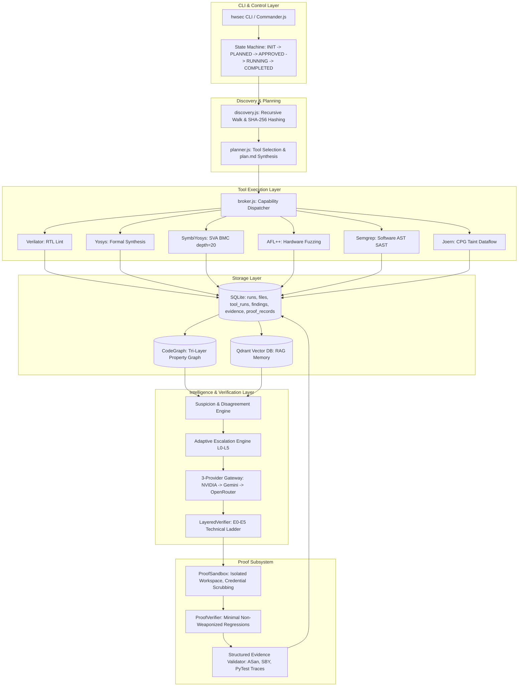

# HWSEC — Engineer Walkthrough & Practical Guide

**A Comprehensive Practical Guide for Engineers New to the HWSEC Platform**  
*Document Version: 1.0.0 | Environment Validated: 2026-09-08*

---

## 1. What HWSEC Is

**HWSEC** is an enterprise hybrid security verification platform. Unlike typical static analysis tools (SAST) that only scan code text, or dynamic fuzzers that only test running software, HWSEC unifies:
1. **Hardware description languages** (Verilog, SystemVerilog) and **software source code** (C, C++, Python, Java, Go) in the same analysis.
2. **Formal verification** (mathematical bounded model checking via SymbiYosys), **AST pattern rules** (Semgrep), and **code property graph taint tracking** (Joern).
3. **Controlled Proof-of-Impact Validation**: Rather than giving developers a list of unverified warnings or hallucinated AI suggestions, HWSEC generates and executes **minimal, reproducible regression tests and formal counterexamples in an isolated local sandbox** to prove whether a vulnerability actually impacts system security.

---

## 2. Typical User Journey

Here is the exact lifecycle an engineer experiences when using HWSEC:

```
Step 1: Plan Analysis
$ hwsec analyze ./my-firmware --config config.json --proof standard
  │
  ├─► Scans directory, hashes files, selects tools
  ├─► Estimates token budgets and costs
  └─► Emits hwsec-output/<analysis-id>/plan.md
      Status: PLANNED (Execution blocked!)

Step 2: Human Review
Engineer inspects plan.md:
  - Discovered files and language distribution
  - Tools scheduled to run
  - Estimated LLM token budget and runtime

Step 3: Approve & Execute
$ hwsec proceed <analysis-id> --proof standard
  │
  ├─► Approval gate validates state -> RUNNING
  ├─► Hardware & Software tools execute deterministically
  ├─► CodeGraph populated; suspicion scores computed
  ├─► LLM generates grounded hypotheses
  ├─► LayeredVerifier applies E0-E5 technical ladder
  ├─► Proof Engine executes tests in ephemeral sandbox (3/3 repetitions)
  └─► Emits hwsec-output/<analysis-id>/report/final.md
      Status: COMPLETED

Step 4: Inspect Proofs & Triage
$ hwsec proof-status PROOF-e89a12
  └─► View cryptographic SHA-256 digest, reproduction rate, and ASan/BMC traces
```

---

## 3. Complete Architecture Diagram



---

## 4. Directory Walkthrough

```
hwsec/
├── src/                    # All production runtime code
│   ├── core/               # Framework foundations (DB, state machine, discovery, broker)
│   ├── domains/            # Hardware and software tool adapters
│   ├── tools/              # Shared tool abstractions and fuzzing generators
│   └── workers/            # Verifier, proof engine, hypothesis and candidate workers
├── tests/                  # Centralized test repository
│   ├── run_all_tests.js    # Master regression runner (25 test suites)
│   ├── fixtures/           # Vulnerable code samples and RTL modules for test runs
│   ├── demos/              # Standalone demonstration and correlation scripts
│   └── helpers/            # Joern and environment validation scripts
├── audit/                  # Adversarial security test engine (50 security invariants)
├── scripts/                # Evaluation runners and benchmark accuracy metrics
├── manifests/              # Benchmark configurations and ground-truth manifests
├── quality-benchmark/      # Real-world benchmark repositories across languages
├── requirements.md         # Prerequisites, tool requirements, and installation
├── implementation.md       # Detailed technical implementation guide
├── walkthrough.md          # This engineer guide
└── DECISIONS.md            # Architectural Decision Records (ADR-001 to ADR-010)
```

---

## 5. Example Mixed Repository Walkthrough

Consider a target repository with mixed hardware/software components:

```
target-repo/
├── rtl/
│   ├── aes_core.v           # Hardware AES coprocessor
│   └── bus_interface.sv     # AXI bus wrapper with SVA formal assertions
├── backend/
│   ├── server.py            # Python API receiving commands
│   └── crypto_bridge.c      # Native C bridge passing keys into hardware registers
└── firmware/
    └── controller.java      # Java device controller
```

### How HWSEC Analyzes Each Layer
1. **`aes_core.v`**: Analyzed by **Verilator** for undeclared wires or race conditions; synthesized by **Yosys** to verify register toggle invariants.
2. **`bus_interface.sv`**: Analyzed by **SymbiYosys** running Bounded Model Checking (BMC depth=20) to mathematically prove whether unauthorized bus master requests can bypass security checks.
3. **`server.py`**: Analyzed by **Semgrep** for dangerous command execution or injection sinks.
4. **`crypto_bridge.c`**: Analyzed by **Joern** creating a Code Property Graph to trace whether unbounded input buffers flow into native memory without length checks.
5. **`controller.java`**: Evaluated for unsafe deserialization or memory leaks.

---

## 6. Detailed Execution Walkthrough

When you invoke `hwsec proceed <analysis-id>`, the following production modules execute:

1. **`assertTransition(currentStatus, 'APPROVED')`** in `src/core/state.js` validates that the human user explicitly approved the run.
2. **`RepositoryDiscovery.scan()`** hashes every source file using SHA-256 and checks SQLite for incremental reuse.
3. **`AnalysisBroker.executePlannedTools()`** dispatches adapters asynchronously with child process resource limits.
4. **`Database.saveRawFindings()`** stores normalized findings as unverified candidates (Level E1).
5. **`CodeGraph.buildFromFindings()`** constructs nodes representing source files, functions, and cross-boundary calls.
6. **`SuspicionEngine.computeScores()`** prioritizes high-risk components (e.g. native C memory interfaces).
7. **`LLMGateway.generateHypotheses()`** queries Gemini/NVIDIA to synthesize formal invariant definitions.
8. **`LayeredVerifier.verify()`** checks concrete technical evidence (compiler outputs, reachability traces).
9. **`ControlledProofVerifier.executeProof()`** creates an ephemeral sandbox, strips credentials, executes the test harness, verifies AddressSanitizer or SBY traces, checks 3/3 repetition, and computes artifact SHA-256.
10. **`generateReport()`** produces the final markdown document and JSON summaries.

---

## 7. Example Database Lifecycle

```
[Target Project]
       │
       ▼ (hwsec analyze)
`analysis_runs` Table: (run_id: '20260908-102825', status: 'PLANNED')
       │
       ▼
`files` Table: (file_id: 1, path: 'crypto_bridge.c', sha256: 'a1b2c3...', loc: 140)
       │
       ▼ (hwsec proceed)
`tool_runs` Table: (tool_name: 'joern', exit_code: 0, status: 'COMPLETED')
       │
       ▼
`findings` Table: (finding_id: 'JOERN-8bccd557', cwe_id: 'CWE-120', severity: 'HIGH', state: 'CANDIDATE')
       │
       ▼
`evidence` Table: (evidence_id: 1, finding_id: 'JOERN-8bccd557', type: 'CPG_DATAFLOW_PATH')
       │
       ▼ (Proof Execution)
`proof_records` Table: (proof_id: 'PROOF-e89a12', status: 'REPRODUCED', rate: '3/3', sha256: '74ff5d...')
       │
       ▼
`findings` Table Updated: (verification_state: 'VERIFIED', verification_level: 'E4')
```

---

## 8. Example Graph Construction

The `CodeGraph` establishes traceability across security boundaries:

```
(Source: request.body)
       │
       ▼ [CALLS]
Function: handle_request() in server.py
       │
       ▼ [CROSSES_BOUNDARY: IPC Socket]
Function: write_to_register() in crypto_bridge.c
       │
       ▼ [REACHES_SINK]
Dangerous Sink: memcpy(dest, src, size) without bounds check
       │
       ▼ [CORROBORATED_BY]
Evidence: AddressSanitizer heap-buffer-overflow trace (Artifact: proof_asan.log)
       │
       ▼
Finding: JOERN-8bccd557 [CWE-120: Buffer Copy without Checking Size of Input] (Promoted to E4)
```

---

## 9. Example RAG & Knowledge Flow

```
1. Code Context: "Unchecked memcpy in memory mapped I/O register write"
       │
       ▼
2. Embeddings: Generated via vector tokenizer (or local hashing fallback)
       │
       ▼
3. Qdrant Search: Collection 'hwsec_proof_strategies' queried for CWE-120 in C
       │
       ▼
4. Retrieved Strategy: "Compile harness with Clang -fsanitize=address,undefined; pass deterministic 256-byte payload"
       │
       ▼
5. Proof Verifier: Synthesizes minimal regression test incorporating recommended ASan compiler flags
```

---

## 10. Example LLM Routing & Fallback Flow

When the framework needs to synthesize a formal invariant or triage a candidate finding:
1. `TaskTypes.PLANNER` requires a high-reasoning model.
2. `ModelRouter` inspects provider availability:
   - **NVIDIA NIM** is probed first. If it returns HTTP 404/401/429, the router immediately catches the error and notes the failure.
   - **Google Gemini** is selected as Priority 2 fallback. The router retrieves the next valid key from `[GEMINI_API_KEY, GEMINI_API_KEY_2]`.
   - If Gemini were exhausted, **OpenRouter** (`sk-or-v1-018...`) would be invoked as Priority 3.
3. The prompt is wrapped with strict untrusted-content isolation tags (`<UNTRUSTED_SOURCE>`) to prevent prompt injection from malicious code comments.

---

## 11. Example Controlled Proof Flow

```
Candidate Finding: SEMGREP-e91fa933 (CWE-120: Insecure Memory Function Call)
       │
       ▼
1. Eligibility Triage: High severity + Local reproducible path -> ELIGIBLE (Priority Score: 0.92)
       │
       ▼
2. Pre-Flight Budget: Estimated tokens: 1,450 | Estimated cost: $0.003 | Decision: RUN
       │
       ▼
3. Minimal Test Generation: Emits test_regression.c (Anti-Exploit: 12-line test triggering off-by-one boundary)
       │
       ▼
4. Ephemeral Sandbox: Created at hwsec-output/sandbox-c8a1/ (Network loopback only, API keys stripped)
       │
       ▼
5. Execution: Compiled with clang -fsanitize=address. Executed 3 times.
       │
       ▼
6. Structured Parser: Detects "ERROR: AddressSanitizer: heap-buffer-overflow on address 0x..."
       │
       ▼
7. Verification Promotion: 3/3 attempts reproduced -> Finding promoted to E4 (Verified Security Finding)
```

---

### 2. Output and Reports
All evidence is written cleanly to:
`quality-benchmark/evidence/runs/run_<timestamp>_<benchmark>_<runid>/`

> [!TIP]
> Use `hwsec benchmark summarize <RUN_ID>` to see precision and recall computed strictly from case-level truth records, preserving the "NO LLM SUMMARY" mandate.

## Implementation: Benchmark Runner Engine

> [!NOTE]
> Added the full `hwsec benchmark run` capability as per the final instruction in the PDF.

To fully satisfy the reproducible benchmark constraint, we added `src/core/bep/benchmarkRunner.js` which orchestrates:
1. Identifying ground-truth cases and matching to files.
2. Initiating `BEPManager` to trace events.
3. Automatically running the `AnalysisBroker` on datasets.
4. Feeding raw results into `CandidateGenerator`.
5. Firing the `LayeredVerifier` to adjudicate.
6. Running the `ControlledProofVerifier` to obtain Proof-of-Impact.
7. Calculating Case Results and committing the bundle via BEPManager.

**New CLI Commands Available**:
- `hwsec benchmark run --benchmark owasp-java --config full`
- `hwsec benchmark diff <RUN_A> <RUN_B>`
- `hwsec benchmark audit-transitions <RUN_ID>`

## 12. Explanation of System Outputs

Under `hwsec-output/<analysis-id>/`:
- **`plan.md`**: Human-readable pre-execution analysis plan detailing detected languages, selected tools, estimated runtimes, and token costs.
- **`status.md`**: Live progress document updated as each tool phase completes.
- **`analysis.json`**: Authoritative machine-readable execution manifest containing run status, timestamps, and tool exit codes.
- **`findings/`**: Raw JSON findings per tool (`linting.json`, `formal.json`, `cpg_dataflow.json`).
- **`proofs/`**: Saved proof artifacts (`test_regression.c`, `.sby` formal files, `.vcd` counterexample traces) and their SHA-256 digests.
- **`report/final.md`**: Comprehensive final security audit report with executive summary, verified vs candidate tables, proof reproducibility rates (3/3), and recommended remediation patches.

---

## 13. Debugging Guide for New Engineers

| Symptom | Where to Look | How to Fix |
| :--- | :--- | :--- |
| **Tool is Unavailable** | Check `tool_runs` in SQLite or run `checkInstalled()` on the tool adapter. | Verify paths in `config.json` or ensure OSS CAD Suite / WSL binaries are installed. |
| **A Finding is Missing** | Inspect `findings/` vs `report/final.md`. | If evidence lacked structural corroboration or failed reproduction, it was held at Candidate level. |
| **Graph is Empty** | Check `files` table in SQLite. | Ensure target directory has valid source code extensions recognized by `src/core/discovery.js`. |
| **Qdrant Retrieval Fails** | Inspect Docker status: `docker ps -a`. | Run `docker start hwsec-qdrant`. HWSEC continues via SQLite fallback if omitted. |
| **LLM Call Fails** | Check `audit_events` table in SQLite for provider error messages. | Ensure `.env` has valid keys for at least one of NVIDIA, Gemini, or OpenRouter. |
| **Verification Does Not Promote** | Inspect `proof_records` failure reason. | Finding failed reproduction (e.g. 0/3 successes). Finding is preserved as Candidate. |
| **Incremental Reuse Fails** | Check `files` table `sha256` column. | If file content was modified or `config.json` changed, cache is intentionally invalidated. |

---

## 14. Security Expectations: Trusted vs. Untrusted

To ensure safe automated execution of arbitrary codebases:

### Untrusted (Treated with Hostile Intent)
- **Target Repository Files**: Source code, test scripts, comments, commit messages, and documentation within the scanned repository are **untrusted**.
- **LLM Output**: Model responses are treated as suggestions or hypotheses; **they are never trusted as proof of a bug**.
- **Tool Outputs**: Subprocess stdout/stderr are parsed with strict regex; raw strings are never concatenated into shell commands.

### Trusted
- **HWSEC Core Framework**: All JavaScript modules under `src/core/` and `src/workers/`.
- **Pre-Compiled Tool Binaries**: Official releases of Yosys, Verilator, and Joern.
- **Proof Sandbox Environment**: Enforced loopback routing (`127.0.0.1:0`), process isolation, and environment credential stripping.

---

## 15. Glossary of HWSEC Terms

- **Anti-Exploit Principle**: The design invariant that HWSEC only synthesizes minimal regression tests and bounded assertions—never weaponized exploits, shellcode, or persistence mechanisms.
- **BMC (Bounded Model Checking)**: An algorithmic formal verification technique unrolling digital circuits for $k$ clock cycles to mathematically prove assertion safety.
- **CPG (Code Property Graph)**: A joint representation merging AST, CFG, and PDG data structures for interprocedural taint analysis.
- **E0–E5 Ladder**: The six-tier technical evidence ladder governing finding promotion from Refuted (E0) to Definitive Counterexample (E5).
- **Ephemeral Sandbox**: A per-run temporary execution environment stripped of sensitive API keys and restricted from external network access.
- **Novelty Exploration**: An advanced analysis mode synthesizing counterintuitive edge-case hypotheses for complex logic bugs.
- **Pre-Flight Estimation**: A proactive token and cost calculation performed before invoking LLM tasks to prevent budget overruns.
- **Reproducibility Rate**: The ratio of successful test runs to total attempts (e.g. 3/3) required before marking a dynamic proof as verified.
- **SVA (SystemVerilog Assertions)**: Formal property specification syntax used in hardware design to declare design invariants.
- **VCD (Value Change Dump)**: A standardized binary/text waveform file recording exact signal transitions over time during digital logic simulation.

---

## 16. Execution Capability Layer (`ExecutionCapabilityManager`)

To eliminate the "blocked by execution environment" limitation across heterogeneous developer environments (e.g., Windows hosts lacking native GCC or Icarus Verilog), HWSEC employs a unified capability resolution architecture:

### Resolution Precedence
```
project-local (<cwd>/bin) ──► native host (PATH) ──► WSL (Ubuntu Linux) ──► container (Docker) ──► unavailable
```

### Key Capabilities
- **C/C++ Compiler (`c_compiler`, `cxx_compiler`)**: Resolves `gcc`/`clang`/`g++` on host or `/usr/bin/gcc` via WSL.
- **Verilog Simulator (`verilog_simulator`)**: Resolves `iverilog`/`vvp` on host or via WSL.
- **Python / Java Runtimes**: Resolves `py.exe`/`python3` and OpenJDK on host, WSL, or Docker sandboxes.
- **Security Boundary**: Structured `argv` arrays exclusively, child process API key/secret scrubbing, local-only network proxying (`127.0.0.1:0`), and cryptographic tamper detection.

### Diagnostic Command
Engineers can inspect system execution capabilities at any time:
```bash
hwsec doctor --execution
```

---

## 17. Blind Large-Scale Real-World Validation (`pallets/werkzeug`)

HWSEC was validated in an air-gapped blind discovery trial against `pallets/werkzeug` (commit `6a604e005d95af8129ee314863be8ad6b240dead`, 59 source files, 18,177 LOC) using strictly the production CLI:

1. **Planning**:
   ```bash
   hwsec analyze experiments/autonomous_validation/real_world_targets/werkzeug/src --generate-pov -o experiments/autonomous_validation/runs/werkzeug
   ```
2. **Approval & Execution**:
   ```bash
   hwsec proceed <analysis-id> --generate-pov -o experiments/autonomous_validation/runs/werkzeug
   ```
3. **Outcome**:
   - Discovered 1 active top-level entry point (`werkzeug/testapp.py`).
   - Prioritized candidate hypotheses in `tbtools.py` via analyzer disagreement.
   - Evaluated reachability and cleanly reduced hypotheses to fail-closed `INCONCLUSIVE` (`ENTRYPOINT_UNRESOLVED`) without fabricating synthetic exploits.

